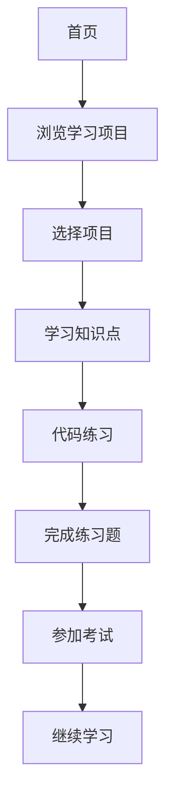

## 1. Product Overview
商务数据分析学习平台，专为商务数据分析与应用专业高职大二学生设计，提供沉浸式Python数据分析学习体验。
- 为已学过Python基础、数据采集与处理的学生提供进阶商务数据分析课程
- 打造10个学习项目，包含知识点、练习、考试和可运行代码纠错功能

## 2. Core Features

### 2.1 User Roles
| Role | Registration Method | Core Permissions |
|------|---------------------|------------------|
| 学生用户 | 无需注册，直接使用 | 浏览课程、学习项目、完成练习和考试、运行代码 |

### 2.2 Feature Module
1. **首页**: 英雄区、导航栏、项目概览、平台特色
2. **项目详情页**: 知识点讲解、代码编辑器、练习模块、考试模块
3. **课程大纲页**: 完整的10个学习项目介绍

### 2.3 Page Details
| Page Name | Module Name | Feature description |
|-----------|-------------|---------------------|
| 首页 | 英雄区 | 展示平台名称、slogan、开始学习按钮 |
| 首页 | 项目概览 | 10个学习项目卡片，点击进入详情 |
| 项目详情页 | 知识点讲解 | 详细的商务数据分析知识点讲解 |
| 项目详情页 | 代码编辑器 | 在线Python代码编辑器，支持运行和纠错 |
| 项目详情页 | 练习模块 | 交互式练习题，即时反馈 |
| 项目详情页 | 考试模块 | 单元测试，评估学习成果 |

## 3. Core Process
用户访问首页 → 浏览10个学习项目 → 选择项目进入详情页 → 学习知识点 → 在代码编辑器中练习 → 完成练习题 → 参加考试 → 继续学习下一个项目

## 4. User Interface Design
### 4.1 Design Style
- 主色调: 深蓝色 (#1e40af) 和天蓝色 (#3b82f6)
- 辅助色: 柔和的蓝绿色渐变 (#0ea5e9)
- 按钮风格: 圆角矩形，悬停时有轻微上浮和阴影效果
- 字体: 现代无衬线字体，标题使用更有设计感的字体
- 布局风格: 卡片式布局，清晰的信息层级
- 图标: 使用Lucide React图标库，简洁现代

### 4.2 Page Design Overview
| Page Name | Module Name | UI Elements |
|-----------|-------------|-------------|
| 首页 | 英雄区 | 渐变背景，大标题，动画效果，卡片网格 |
| 首页 | 项目卡片 | 悬停动画，项目图标，进度指示器 |
| 项目详情页 | 知识点区域 | 清晰的标题层级，代码高亮，示例展示 |
| 项目详情页 | 代码编辑器 | Monaco编辑器风格，语法高亮，运行按钮 |
| 项目详情页 | 练习/考试 | 卡片式题目，选项高亮，反馈动画 |

### 4.3 Responsiveness
- Desktop-first设计，完美适配1024px以上屏幕
- 平板和移动端自适应布局，保证学习体验
- 触摸优化的交互元素

### 4.4 10个学习项目
1. 数据清洗实战
2. 分组聚合分析
3. 购物篮分析
4. 客户聚类分析
5. 数据可视化
6. A/B测试分析
7. 时间序列分析
8. 特征工程
9. 异常值检测
10. 多数据集合并
